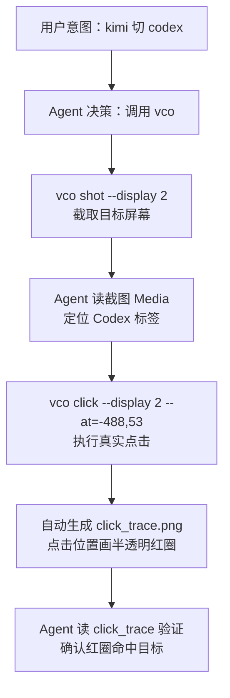

# vco click 留痕链路示例：kimi → codex

## 1. 目标

演示 Agent 如何通过 `vco` 完成一次真实屏幕点击，并自动生成带红圈的留痕图。

## 2. 链路流程



## 3. 关键素材

### 3.1 display 2 原始截图


> 右上角可见 `Kimi Code` / `Codex` / `Claude Code` 三个标签。

### 3.2 点击后的留痕图


> 红圈正中 `Codex` 标签，证明点击坐标正确。

### 3.3 链路总览图


## 4. 关键命令

```bash
# 1. 看目标屏幕
vco shot --display 2

# 2. 执行点击（坐标根据截图估算）
vco click --display 2 --at=-488,53

# 3. 查看自动生成的留痕图
ls -lt ./.screenshot/click-*.png
```

## 5. 经验与注意事项

- `vco click` 默认生成 `click_trace.png`，可用 `--no-click-trace` 关闭。
- 多屏场景用 `--display N` 指定目标屏幕。
- OCR 在目标密集、带状态灯、字号小的场景容易把中心点算偏。
- 最终命中靠 Agent 直接读截图（Media）人工估算坐标。
- 本次 Codex 标签虽然点中了，但面板未切换，可能原因：Codex 未安装 / 未登录 / 当前不可用。

## 6. 可编辑说明

本文档是 Markdown，你可以：

- 直接修改文字、替换截图路径；
- 在 VS Code / GitHub / Mermaid Live Editor 中预览流程图；
- 用 Marp、Slidev、Typora 等工具转成幻灯片。
